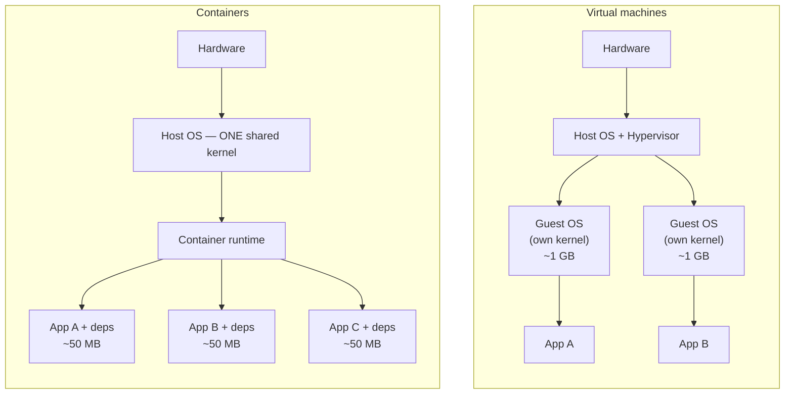
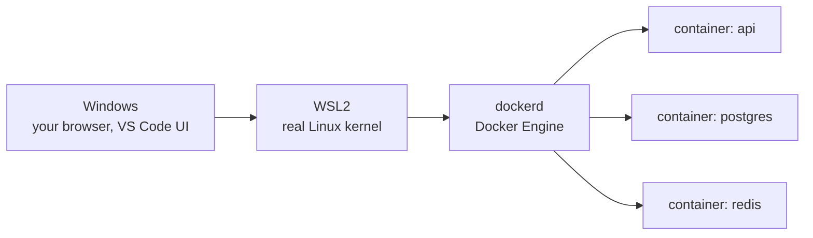
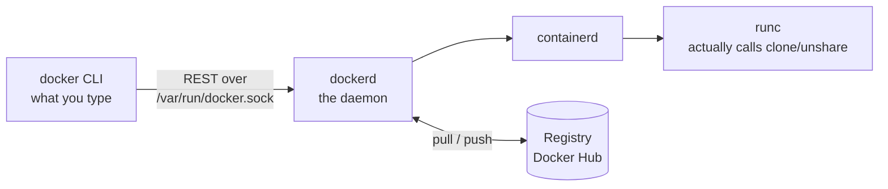
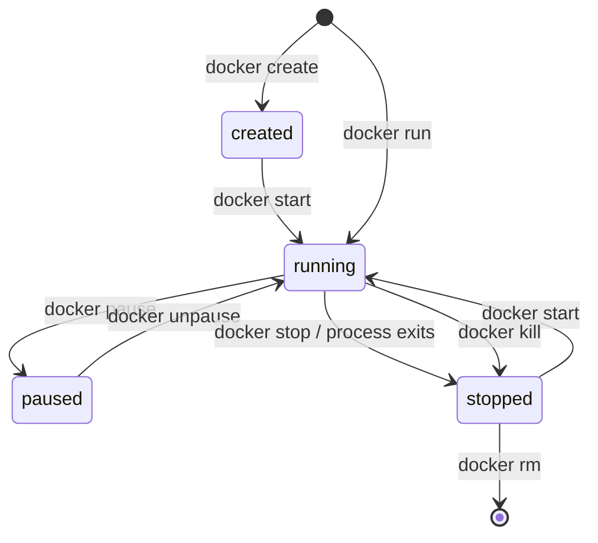

# Day 1 — Foundations: what a container really is

**Goal:** stop thinking of a container as "a small virtual machine". Everything
that confuses people later comes from that one wrong mental model.

| | |
|---|---|
| **Before class** | [SETUP.md](../SETUP.md) done, all smoke tests passing |
| **Warm-up** | KodeKloud Playground, 15 min — see [ONLINE-LABS.md](../ONLINE-LABS.md) |
| **Lab** | [lab/](lab/) |
| **Homework** | [homework.md](homework.md) |

---

## 1. The problem containers solve

You have all met some version of this:

> "It works on my machine."

The reason it works on your machine is that your machine has a specific OS
version, a specific Node/Python version, a specific set of system libraries, a
specific set of environment variables, and a `/etc/hosts` you edited six months
ago and forgot.

Your application does not depend only on your code. It depends on everything
around your code. **Deployment is the act of reproducing that environment
somewhere else**, and doing it by hand is where most of the pain lives.

Two available answers:

**Virtual machines.** Ship the whole operating system. Correct, and heavy: a
full kernel, a full init system, gigabytes of image, tens of seconds to boot.

**Containers.** Ship your application plus its dependencies, and *borrow the
host's kernel*. Megabytes instead of gigabytes, milliseconds instead of
seconds.

---

## 2. VM vs container



| | Virtual machine | Container |
|---|---|---|
| Kernel | Its own | **Shared with the host** |
| Boot time | 30–60 s | 50–500 ms |
| Image size | GBs | MBs |
| Isolation | Very strong (hardware-level) | Strong, but kernel-level |
| Runs a different OS kernel | Yes | **No** |

That last row is the honest limitation. **A Linux container needs a Linux
kernel.** This is exactly why you are running WSL2: Windows cannot run Linux
containers directly, so WSL2 provides a real Linux kernel for them to share.

### Which means your machine looks like this



**There are two hosts in your setup, not one.** Windows, and the WSL2 Linux VM.
Almost every WSL-specific confusion in this course is a consequence of that
line between them. Keep this picture in your head.

---

## 3. What a container is actually made of

There is no such thing as a "container" object in the Linux kernel. A container
is an ordinary process that the kernel has been told to lie to. Three
mechanisms do the lying:

### Namespaces — what a process can *see*

A namespace partitions a global system resource so that the process inside
believes it has its own copy.

| Namespace | Controls | Effect inside |
|---|---|---|
| `pid` | Process IDs | Your process is PID 1; host processes are invisible |
| `net` | Interfaces, routes, ports, iptables | Its own `eth0` and its own port 80 — **all of Day 4** |
| `mnt` | Mount points | Its own filesystem tree — **all of Day 3** |
| `uts` | Hostname | `hostname` returns the container ID |
| `ipc` | Shared memory, semaphores | Cannot see the host's IPC objects |
| `user` | UID/GID mapping | Can be root inside while unprivileged outside |

### Cgroups — what a process can *use*

Control groups cap and account for CPU, memory, disk and network I/O. This is
what `--memory=512m` and `--cpus=1` set. Exceed the memory limit and the kernel
OOM-kills the process — you will watch this happen today.

### Union filesystem — where its files come from

An image is a stack of read-only layers. Starting a container adds one thin
writable layer on top. Reads fall through the stack; writes copy the file up
into the writable layer first (**copy-on-write**). Delete the container, delete
that writable layer, and every change is gone.

That is why the Day 1 lab has you install a package in a container, exit, and
find it gone. It is not a bug. It is the entire design, and it is why volumes
exist (Day 3).

> **Take this away:** namespaces limit what it sees, cgroups limit what it
> uses, layers give it a filesystem. Nothing is virtualized. It is a process.

---

## 4. The pieces of Docker



- **`docker` CLI** — sends HTTP requests to a socket. It does nothing itself.
- **`dockerd`** — builds images, manages networks and volumes, owns the state.
- **`containerd` / `runc`** — the layers that actually create the namespaces
  and cgroups.
- **Registry** — where images are stored and shared.

This is why `Cannot connect to the Docker daemon` is such a common error: the
CLI is fine, the daemon is not running. The two are separate programs.

> **Security consequence.** Anyone who can talk to that socket can start a
> privileged container that mounts the host filesystem. That is why membership
> in the `docker` group is equivalent to root, as [SETUP.md](../SETUP.md)
> warned. It is also why "just mount `/var/run/docker.sock` into the container"
> is a much bigger decision than it looks.

---

## 5. Image vs container

The distinction people get wrong for weeks:

| | Image | Container |
|---|---|---|
| Is | A template, read-only | A running (or stopped) instance |
| Analogy | A class | An object |
| Analogy | An installer / an ISO | The installed, running program |
| Created by | `docker build` | `docker run` |
| How many | One | Many, all from the same image |
| Survives removal | Yes | Its writable layer does not |

```
image: training-api:ref
   ├── container a1b2c3  (running,  port 8080)
   ├── container d4e5f6  (running,  port 8081)
   └── container 789abc  (stopped)
```

All three share the same read-only layers on disk. Only the thin writable layer
is per-container — which is why starting the tenth container costs almost
nothing.

---

## 6. Container lifecycle



Two things worth knowing now:

**`docker run` = `docker create` + `docker start`.** One command, two steps.

**A container lives exactly as long as its main process.** It is not a machine
that "is up". If PID 1 exits, the container stops. This is why

```bash
docker run ubuntu
```

exits immediately — `bash` with no terminal attached has nothing to do, so it
ends, so the container ends. Nothing is broken.

**`docker stop` sends SIGTERM, waits 10 seconds, then SIGKILL.** A process that
handles SIGTERM stops in under a second. One that ignores it takes the full ten
every time. Multiply by five services and `docker compose down` takes a minute
— which is why the lab app installs signal handlers, and why Day 2's exec-form
discussion matters.

---

## 7. Live demos

Your instructor runs these. Watch, do not type.

### Demo 1 — a container is a process on the host

```bash
docker run -d --name proof alpine sleep 999
docker inspect proof --format '{{.State.Pid}}'   # e.g. 48213
ps -p <that pid> -o pid,user,comm                # the same sleep, in WSL2
```

The PID that Docker reports is a real WSL2 process. Inside the container that
same process believes it is PID 1:

```bash
docker exec proof ps
```

One process. Two different PIDs, depending on which namespace is asking.

### Demo 2 — cgroups are real

```bash
docker run --rm --memory=100m alpine \
  sh -c 'dd if=/dev/zero of=/dev/shm/fill bs=1M count=500'
```

Killed partway through. Then check:

```bash
docker inspect --format '{{.State.OOMKilled}}' <container>
```

The kernel enforced the limit. Nothing in the application agreed to it.

---

## 8. Vocabulary

| Term | Meaning |
|---|---|
| **Image** | Read-only template made of layers |
| **Container** | A running or stopped instance of an image |
| **Layer** | One read-only filesystem diff inside an image |
| **Registry** | Server storing images (Docker Hub, GHCR, ECR) |
| **Tag** | A label on an image: `nginx:1.27` |
| **Dockerfile** | The recipe for building an image (Day 2) |
| **Volume** | Storage that outlives a container (Day 3) |
| **Network** | A virtual network containers attach to (Day 4) |
| **Compose** | Declaring a multi-container system in YAML (Day 5) |

---

## Checklist

You are ready for Day 2 when you can answer without looking:

- [ ] Why can a container start in milliseconds when a VM takes 30 seconds?
- [ ] What do namespaces do? What do cgroups do?
- [ ] Why does data disappear when a container is removed?
- [ ] What is the difference between an image and a container?
- [ ] Why does `docker run ubuntu` exit immediately?
- [ ] How many "hosts" are there between your browser and a container on your machine?

→ [Lab](lab/) · [Homework](homework.md)
