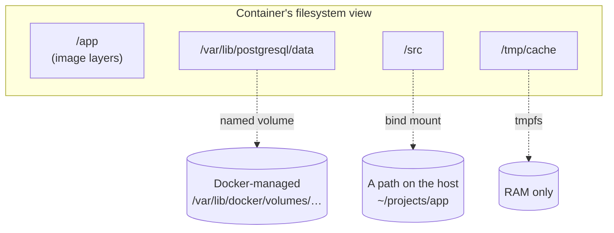

# Day 3 — Volumes & persistent data

**Goal:** be able to look at any `-v` or `--mount` flag and say, before running
it, exactly what the container will see.

On Day 1 you watched a container lose everything on `docker rm`. Today you
learn the three ways to stop that, and — more importantly — the rules that
decide what happens when a mount lands on a directory that already has files in
it. Those rules cause more confusion in real projects than anything else in
Docker.

| | |
|---|---|
| **Warm-up** | KodeKloud Playground, 15 min — create a volume, mount it, write a file, destroy the container, prove the file survived |
| **Lab** | [lab/](lab/) |
| **Homework** | [homework.md](homework.md) |

---

## 1. Why the container filesystem is not enough

A container's writable layer is **copy-on-write**, **per-container**, and
**destroyed with the container**. For a database that is three separate
problems:

- **It disappears.** `docker rm` takes your data with it. So does replacing the
  container to upgrade the image — which is the normal way you deploy.
- **It is slow.** Every write to an existing file first copies that file up
  from a lower layer. For a database file this is the worst possible pattern.
- **It cannot be shared.** Two containers cannot both see it.

So: **anything that must outlive the container, or be shared, goes through a
mount.**

---

## 2. The three mount types

The unifying idea, which makes the rest follow: **a container has its own mount
namespace, and all three types are just mounts into that namespace.** They
differ only in where the storage comes from.



### Named volume — the default for data

```bash
docker volume create pgdata
docker run -v pgdata:/var/lib/postgresql/data postgres:17-alpine
```

Docker manages it. It lives at `/var/lib/docker/volumes/<name>/_data`. Docker
decides the layout; you refer to it by name.

**Use for:** database files, uploads, anything the application owns.

**Why it is the default:** portable (no host paths in your compose file),
backed by a real filesystem, and it survives `docker rm`.

> On WSL2 that path is inside your distro's `ext4.vhdx`. It is a genuine ext4
> directory — you can `sudo ls /var/lib/docker/volumes/pgdata/_data` and look
> at the Postgres files. See [WSL2-NOTES.md](../WSL2-NOTES.md) #4 for what that
> means for your C: drive.

### Bind mount — the default for source code

```bash
docker run -v ~/projects/app:/src node:22-alpine
```

You choose an exact host path. Changes on either side are visible immediately
in the other — same files, two views.

**Use for:** source code in development (hot reload), injecting a config file,
getting logs out during debugging.

**Do not use for:** database data. You are handing the DB's storage layout to
whatever filesystem the host happens to have.

> **On WSL2:** bind mount from `~`, never `/mnt/c`. See
> [WSL2-NOTES.md](../WSL2-NOTES.md) #1 — you will measure the difference in
> Exercise 6.

### tmpfs — RAM only

```bash
docker run --tmpfs /tmp/cache:size=64m alpine
```

Never touches disk. Vanishes when the container stops.

**Use for:** decrypted secrets, scratch space, anything that must not be
written to disk.

### Choosing

| Need | Use |
|---|---|
| Database files | **Named volume** |
| Source code with hot reload | **Bind mount** |
| One config file into a container | **Bind mount**, `:ro` |
| Uploads the app writes | **Named volume** |
| Secrets that must not touch disk | **tmpfs** |
| Sharing data between two containers | **Named volume** |
| Getting a log file out during debugging | Bind mount, or `docker cp` |

---

## 3. `-v` vs `--mount`

Two syntaxes for the same thing. They are not equally safe.

```bash
# short
-v pgdata:/var/lib/postgresql/data
-v ~/projects/app:/src:ro

# long
--mount type=volume,src=pgdata,dst=/var/lib/postgresql/data
--mount type=bind,src=/home/me/projects/app,dst=/src,readonly
```

The long form is more typing and better, for one reason: **`-v` fails
silently, `--mount` fails loudly.**

**Missing host path.** Verified behaviour:

```bash
docker run -v /path/that/does/not/exist:/x alpine ls /x
# runs fine. Docker CREATED the directory for you. /x is empty.

docker run --mount type=bind,src=/path/that/does/not/exist,dst=/x alpine ls /x
# docker: Error response from daemon: invalid mount config for type "bind":
#   bind source path does not exist: /path/that/does/not/exist
```

**Typo in a volume name.** Also verified:

```bash
docker run -v pgdta:/var/lib/postgresql/data postgres:17-alpine
```

You meant `pgdata`. Docker does not know that. It creates a **brand-new empty
volume called `pgdta`** and starts Postgres with an empty data directory. No
error. No warning. Your data is not lost — it is sitting in `pgdata`, untouched
— but your application behaves as though it were, and you will spend twenty
minutes convinced the volume "did not work".

**This is the single most common "my data disappeared" cause, and it is a
typo.** `--mount` would have said so.

Use `--mount` when it matters. Recognise `-v` because everyone else writes it.

---

## 4. The rules that catch everyone

**A mount lands on a path that usually already has files in it.** What happens
to them?

There are exactly two rules. Both verified with the commands in Exercise 2.

### Rule 1 — an *empty named volume* is seeded from the image

> "If you mount an *empty volume* into a directory in the container in which
> files or directories exist, these files or directories are propagated
> (copied) into the volume by default."
> — [Docker docs, Volumes](https://docs.docker.com/engine/storage/volumes/)

The image's files are **copied into the volume**, once, on first use. After
that the volume is the source of truth and the image copy is ignored — so
rebuilding the image with different content changes nothing until you delete
the volume.

**Ownership is copied too.** That detail solves a problem in section 6.

### Rule 2 — everything else *hides* what was there

> "If you mount a *non-empty volume* into a directory in the container in which
> files or directories exist, the pre-existing files are obscured by the mount."
> — [Docker docs, Volumes](https://docs.docker.com/engine/storage/volumes/)

And for bind mounts, always:

> "If you bind mount a file or directory into a directory in the container in
> which files or directories exist, the pre-existing files are obscured by the
> mount."
> — [Docker docs, Bind mounts](https://docs.docker.com/engine/storage/bind-mounts/)

Hidden, not deleted. They are still in the image layer, unreachable while the
mount is in place. Remove the mount and they are back.

### Summary

| Mount over a non-empty image directory | Result |
|---|---|
| Empty named volume | Image content **copied into the volume** |
| Non-empty named volume | Image content **hidden** |
| Bind mount (empty or not) | Image content **hidden** |
| tmpfs | Image content **hidden** |

**Bind mounts never seed.** That one sentence prevents the next section.

---

## 5. The `node_modules` disaster

The most common real-world consequence, and every Node developer meets it.

Your Dockerfile runs `npm install`, producing `/app/node_modules` inside the
image. For hot reload you bind-mount your source over `/app`:

```bash
docker run -v ~/projects/app:/app myapi
```

Your host `~/projects/app` has no `node_modules` (it is in `.gitignore` and
`.dockerignore`). By Rule 2 the bind mount **hides** the image's `/app`
entirely — including the `node_modules` you installed at build time.

Verified result:

```
Error: Cannot find module 'express'
```

The container crash-loops. Nothing is wrong with your Dockerfile.

### The fix: shield the subdirectory with an anonymous volume

```bash
docker run -v ~/projects/app:/app -v /app/node_modules myapi
```

`-v /app/node_modules` with **no source** creates an *anonymous volume*. It is
empty, so by **Rule 1** it is seeded from the image — restoring exactly the
`node_modules` the build produced. And because it is mounted *deeper* than
`/app`, it takes precedence there.

Verified: container starts, `/app` shows your source **and** `node_modules`.

In Compose:

```yaml
services:
  api:
    volumes:
      - ./app-api:/app          # your source, live
      - /app/node_modules       # shielded from the mount above
```

The same pattern applies to Python `.venv`, Go build caches, `target/` in
Rust — any directory the build creates inside a path you later bind-mount over.

---

## 6. Ownership and permissions

The other thing that bites, and it is entirely predictable once you see it.

**Verified:** a freshly created named volume mounts as a directory owned by
**root**. A container running as a non-root user cannot write to it:

```bash
docker volume create permvol
docker run --rm --user 1000:1000 -v permvol:/data alpine touch /data/x
# touch: /data/x: Permission denied
```

This is exactly what happens when you follow Day 2's advice to add `USER node`
and then mount a volume. The two good practices collide.

### Three fixes, and which to prefer

**Best — pre-create the directory in the image, with the right owner.** Rule 1
then copies that ownership into the volume when it is seeded:

```dockerfile
RUN adduser -D -u 1000 worker \
    && mkdir -p /data \
    && chown worker:worker /data
USER worker
```

Verified: a fresh named volume mounted at `/data` inherits uid 1000 and the
non-root process writes successfully. This is what
[`labs/app-worker/Dockerfile`](../labs/app-worker/Dockerfile) does, and it is
why the worker can write while the API — which does not pre-create `/data` —
cannot.

**Acceptable — chown once from a privileged one-shot container:**

```bash
docker run --rm --user 0:0 -v permvol:/data alpine chown 1000:1000 /data
```

Works, but it is a manual step someone will forget on a new machine.

**Situational — `--user` at run time:**

```bash
docker run --user "$(id -u):$(id -g)" -v ~/projects/app:/app myapi
```

Useful for **bind mounts in development**, so files the container creates
belong to you on the host rather than to root. The trade-off: that UID may not
exist inside the image, so `whoami` fails and `$HOME` is wrong. Fine for a dev
container, not for production.

### Read-only mounts

```bash
docker run -v ./nginx.conf:/etc/nginx/conf.d/default.conf:ro nginx
```

If the container has no business writing to it, say so. Cheap, and it turns a
whole class of accidents into an error.

---

## 7. Anonymous volumes and the `VOLUME` instruction

A Dockerfile can declare a path as a volume:

```dockerfile
VOLUME /var/lib/postgresql/data
```

The official Postgres image does exactly this — verified:

```bash
docker image inspect postgres:17-alpine --format '{{.Config.Volumes}}'
# map[/var/lib/postgresql/data:{}]
```

Meaning: **if you do not supply a volume, Docker creates an anonymous one** —
a volume with a 64-hex-character name and no owner in your head.

Which is why this happens:

```bash
docker volume ls
# local   0f3a1b...c9e
# local   7d2e4f...118
# local   a91c30...45b   ... and thirty more
```

Every `docker run postgres` without `-v` left one behind. They contain data. You
have no idea which is which.

```bash
docker volume ls -qf dangling=true      # volumes attached to nothing
docker volume prune                      # delete them -- read the warning below
```

> **`docker volume prune` deletes data.** It removes every volume not currently
> attached to a *running or stopped* container — including the database of a
> project you tore down last week. Always `docker volume ls` first.

Two more things about `VOLUME` worth knowing, because they surprise people:

- **It cannot be undone in a child image.** Once a parent declares a path as a
  volume, every descendant inherits it.
- **Writes to that path in *later* Dockerfile instructions are discarded.**
  `VOLUME /data` followed by `RUN echo hi > /data/f` leaves nothing behind: the
  `RUN` writes into a temporary volume that is thrown away at the end of the
  step. If you must seed a directory, write it **before** the `VOLUME` line.

**Advice:** avoid `VOLUME` in your own Dockerfiles. Let the person running the
image decide where data goes. Declaring it takes that choice away and litters
their machine with anonymous volumes.

---

## 8. Volumes as inter-container communication

Containers talk in two ways. Day 4 is the network. Today is the other one.

Mount the same named volume into two containers and they share a directory:

```bash
docker volume create shared
docker run -d --name writer -v shared:/data worker
docker run -d --name reader -v shared:/data api
```

In the lab app, the Python worker writes result files to `/data` and the Node
API serves them from `/data` via `GET /files`. **No network call between them.
No shared language. No shared library.** One filesystem.

| | Network (Day 4) | Shared volume |
|---|---|---|
| Coupling | Both must be running | Producer and consumer can run at different times |
| Failure mode | Connection refused | File not there yet |
| Suits | Request/response | Handoff of large artifacts |
| Watch out for | DNS, ports, isolation | Concurrent writes, no locking |

The last cell matters: **a shared volume gives you no locking.** Two containers
writing the same file will corrupt it. Fine for write-once files with unique
names — as the worker does, stamping each filename with a timestamp. Not fine
as a general-purpose message queue.

---

## 9. Backup and restore

There is no `docker volume backup`. The idiom is a throwaway container that
mounts both the volume and a host directory:

```bash
# Back up
docker run --rm \
  -v pgdata:/data:ro \
  -v "$PWD":/backup \
  alpine tar czf /backup/pgdata-$(date +%F).tar.gz -C /data .

# Restore into a fresh volume
docker volume create pgdata-restored
docker run --rm \
  -v pgdata-restored:/data \
  -v "$PWD":/backup \
  alpine tar xzf /backup/pgdata-2026-07-27.tar.gz -C /data
```

Read it as: mount the volume, mount somewhere to put the file, run one command,
throw the container away. The `alpine` container is a tool, not a service.

> **For a database, stop it first.** A tar of a running Postgres data directory
> is a snapshot of files mid-write and may not restore. For live backups use
> `pg_dump`. The tar idiom is right for volumes whose writer is stopped.

---

## 10. What lives where

```bash
docker volume inspect pgdata --format '{{.Mountpoint}}'
# /var/lib/docker/volumes/pgdata/_data
```

On WSL2 that is a real path inside your distro. You can look:

```bash
sudo ls -la /var/lib/docker/volumes/pgdata/_data
```

**This is worth doing once.** A volume stops being magic the moment you see it
is a directory.

Everything Docker stores lives under `/var/lib/docker`, inside the distro's
`ext4.vhdx`. That file grows and does not shrink on its own — so `docker system
prune` frees space *inside* it without returning anything to Windows. See
[WSL2-NOTES.md](../WSL2-NOTES.md) #4, and Exercise 9.

```bash
docker system df          # what is using space, by category
docker system df -v       # per image, container and volume
```

---

## Checklist

- [ ] Name the three mount types and one correct use of each
- [ ] State both mount rules — when is image content copied, when is it hidden?
- [ ] Explain why bind-mounting your source breaks `node_modules`, and the fix
- [ ] Explain why `--mount` is safer than `-v`
- [ ] Explain why a non-root container cannot write to a fresh named volume, and the best fix
- [ ] Explain where anonymous volumes come from and why you have forty of them
- [ ] Describe two ways containers exchange data without the network

→ [Lab](lab/) · [Homework](homework.md)
