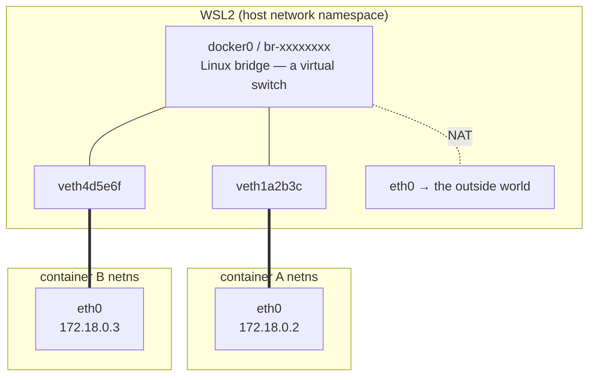
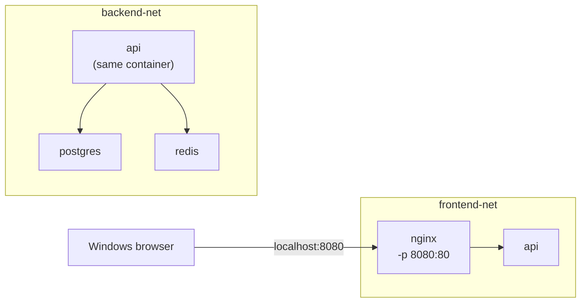
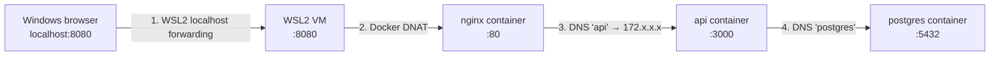

# Day 4 — Networking

**Goal:** when one container cannot reach another, know within a minute which
of the four possible causes it is — instead of changing things at random until
something works.

This is the deep dive. It is also the topic you will use most, because almost
every real system is more than one container.

| | |
|---|---|
| **Warm-up** | KodeKloud Playground, 15 min — two containers on a custom network, ping by name |
| **Lab** | [lab/](lab/) |
| **Homework** | [homework.md](homework.md) |

---

## 1. Every container has its own network stack

Day 1: a container is a process with namespaces. One of those is the **network
namespace**, and it gives the container its own:

- network interfaces (its own `eth0`)
- routing table
- iptables rules
- **port space** — its own port 80, unrelated to yours

That last one answers the question from Day 1's homework: ten containers can
all listen on port 80 because there are ten separate port spaces. There is no
conflict because there is nothing shared to conflict over.

### How the container's `eth0` connects to anything

Docker creates a **veth pair** — a virtual cable with two ends. One end goes
inside the container's namespace and is named `eth0`. The other stays in the
host and is plugged into a **Linux bridge** (a virtual switch).



**On WSL2 you can see all of this**, because you have a real Linux kernel and
Docker Engine runs natively in it:

```bash
ip link show type bridge      # the bridges, one per Docker network
ip link | grep veth           # one veth end per running container
bridge link                   # which veth is plugged into which bridge
```

Start a container and watch a `veth` appear. Stop it and watch it go. Exercise
3 has you do exactly that. On a Mac this is all hidden inside an opaque VM —
**your setup is the better one for learning this.**

---

## 2. The network drivers

```bash
docker network ls
```

```
NETWORK ID     NAME      DRIVER    SCOPE
a1b2c3d4e5f6   bridge    bridge    local
b2c3d4e5f6a1   host      host      local
c3d4e5f6a1b2   none      null      local
```

### `bridge` — the default, and it has a trap

Every container you have run so far without `--network` landed on the network
literally called `bridge`.

**The default `bridge` network has no DNS.** Containers on it cannot resolve
each other by name. Verified:

```bash
docker run -d --name d1 alpine sleep 300
docker run -d --name d2 alpine sleep 300
docker exec d1 ping -c1 d2
```
```
ping: bad address 'd2'
```

By IP it works fine:

```bash
docker exec d1 ping -c1 172.17.0.3
# 1 packets transmitted, 1 packets received, 0% packet loss
```

So the containers **are** connected. Only the naming is missing.

> Docker's very old `--link` flag used to paper over this. It is deprecated and
> you should not use it. If a tutorial uses `--link`, it predates 2016.

### User-defined bridge — what you should always use

```bash
docker network create mynet
docker run -d --name u1 --network mynet alpine sleep 300
docker run -d --name u2 --network mynet alpine sleep 300
docker exec u1 ping -c1 u2
# 1 packets transmitted, 1 packets received, 0% packet loss
```

**Names resolve.** Verified. Where does that come from?

```bash
docker exec u1 grep nameserver /etc/resolv.conf
# nameserver 127.0.0.11
```

**127.0.0.11 is Docker's embedded DNS server**, injected into the container's
network namespace. It knows every container name and network alias on that
network. That is the answer to yesterday's think-about question: nothing in
your code or `/etc/hosts` defines the name `b` — Docker's DNS does.

> Check the address on your own machine rather than trusting the number.
> `127.0.0.11` is what standard Docker Engine uses; some third-party Docker
> distributions use a different address for the default `bridge` network.

User-defined networks also give you:

- **Isolation** — a separate network per project or tier
- **Attach and detach at runtime** — `docker network connect/disconnect`
- **Aliases** — `--network-alias db` gives a container an extra name

**This is what Docker Compose creates for you automatically.** Everything you
learn here transfers directly to tomorrow.

### `host` — no network namespace at all

```bash
docker run --network host nginx
```

The container shares the host's network stack. No veth, no NAT, no `-p`
(publishing is meaningless — it is already there).

**On WSL2, "the host" means the WSL2 VM, not Windows.** Most tutorials are
written for a Linux server where those are the same machine. Yours are not. See
[WSL2-NOTES.md](../WSL2-NOTES.md) #6.

Use it for measured performance needs or tools that must see the host's real
interfaces. Not as a way to "make networking work" — it removes the isolation
that is the reason you are using containers.

### `none` — no networking

```bash
docker run --network none alpine ip addr
```

Only loopback. For batch jobs that must not touch the network.

### `overlay` — multiple hosts

Connects containers across **different machines**, used by Swarm and (in a
different form) Kubernetes. Out of scope here; know the word so you recognise
where the road continues.

---

## 3. Publishing ports — and `EXPOSE`, which does nothing

The most common misunderstanding in this course.

### `EXPOSE` is documentation

```dockerfile
EXPOSE 3000
```

This **publishes nothing**. It records "this image listens on 3000" as
metadata, for humans and for `docker run -P`.

Verified — nginx has `EXPOSE 80`, run with no `-p`:

```bash
docker run -d --name web --network mynet --network-alias web nginx:alpine
docker ps --format '{{.Ports}}'
# 80/tcp                                    ← no arrow. Nothing is published.

curl -I localhost:80
# (fails)

docker run --rm --network mynet alpine sh -c 'apk add -q curl; curl -so /dev/null -w "%{http_code}" http://web'
# 200                                       ← reachable from inside the network
```

**Reachable from another container. Not reachable from your host.** `EXPOSE`
changed nothing.

### `-p` is what publishes

```bash
docker run -d -p 8081:80 nginx:alpine
docker ps --format '{{.Ports}}'
# 0.0.0.0:8081->80/tcp                      ← now there is an arrow
curl -I localhost:8081                      # 200
```

`-p HOST:CONTAINER`. **Left is the host, right is the container.** Read the
arrow in `docker ps` the same way.

Under the hood this is a DNAT rule: traffic arriving at host port 8081 is
rewritten to the container's IP on port 80.

```bash
sudo iptables -t nat -L DOCKER -n | grep 8081
```

### The mapping that looks right and is not

```bash
docker run -d -p 8082:8080 nginx:alpine
curl localhost:8082
# fails
```

`docker ps` shows a perfectly healthy `0.0.0.0:8082->8080/tcp`. But nginx
listens on **80**, not 8080. Docker faithfully forwards host 8082 to container
port 8080, where nothing is listening.

**Docker cannot tell you this.** It does not know what your process listens on.
The right-hand number must match what the application actually binds.

### The one that fools everyone: binding to `127.0.0.1` inside the container

Verified, and worth studying carefully:

```bash
docker run -d -p 8083:8000 python:3.13-alpine \
  sh -c 'python -m http.server 8000 --bind 127.0.0.1'

docker ps --format '{{.Ports}}'
# 0.0.0.0:8083->8000/tcp        ← looks completely correct

curl localhost:8083
# fails

docker exec <c> wget -qO- http://127.0.0.1:8000
# hi                            ← the app IS running and IS listening
```

**Why:** `127.0.0.1` inside the container is the *container's* loopback. Docker
forwards traffic to the container's `eth0` address, and nothing is listening
there.

**Fix: applications in containers must bind `0.0.0.0`.** This is why
[`labs/app-api/server.js`](../labs/app-api/server.js) says
`app.listen(PORT, '0.0.0.0')` with a comment explaining it.

**Recognise this one.** It is the hardest of the four to spot because every
diagnostic looks healthy: the container is up, the port is published, the app
is running, the logs are clean.

---

## 4. Service discovery

On a user-defined network, a container is reachable by:

1. **Its container name** — `--name api` → `http://api:3000`
2. **Any network alias** — `--network-alias db`
3. **Its service name in Compose** — which is just an alias Compose sets

```bash
docker exec u1 nslookup u2
```
```
Server:    127.0.0.11
Address:   127.0.0.11:53
Name:      u2
Address:   172.18.0.3
```

That is why [`labs/app-api/server.js`](../labs/app-api/server.js) defaults to
`PGHOST=postgres` and `REDIS_URL=redis://redis:6379`. Those are not hostnames
anyone configured. They are **service names**, resolved at runtime by Docker.

**Never hard-code container IPs.** They change on every restart. The name is
the stable identity; the IP is an implementation detail.

### Aliases and load balancing

Several containers can share one alias. Docker's DNS then returns **all** their
IPs, and clients spread across them.

This is how `docker compose up --scale api=3` load-balances. And it is why
[`labs/nginx/default.conf`](../labs/nginx/default.conf) contains:

```nginx
resolver 127.0.0.11 valid=10s;
set $upstream http://api:3000;
proxy_pass $upstream$request_uri;
```

**With a plain `proxy_pass http://api:3000;`, nginx resolves the name once at
startup, caches that single IP forever, and sends 100% of traffic to one
replica** — while you watch the other two sit idle and conclude that scaling
"does not work". Using a variable defers resolution to request time.

This is a real production bug, not a lab curiosity.

---

## 5. Isolation between networks

A container can be on several networks at once. That is how you build tiers.



`api` is on both. `nginx` is only on `frontend-net`, so **it cannot resolve
`postgres`**. Postgres is published to nothing, so the host cannot reach it
either.

Verified:

```bash
docker network create demo-net && docker network create other-net
docker run -d --name u1 --network demo-net alpine sleep 300
docker run -d --name o1 --network other-net alpine sleep 300

docker exec o1 ping -c1 u1
# ping: bad address 'u1'          ← different network, name does not resolve

docker network connect demo-net o1
docker exec o1 ping -c1 u1
# 0% packet loss                  ← now on both networks, name resolves
```

### An honest caveat about how strong this is

**Name isolation is reliable** — a container on another network cannot resolve
your service names. That is the boundary you design with, and it is the one
that stops your application from accidentally talking to the wrong tier.

**Packet-level isolation is enforced by iptables, and it is not identical
everywhere.** Standard Docker Engine on Linux installs rules that drop traffic
between different bridge networks. But the chain layout **changed in Docker
28** — the old `DOCKER-ISOLATION-STAGE-1` / `-STAGE-2` chains were replaced by
`DOCKER-FORWARD`, `DOCKER-CT`, `DOCKER-INTERNAL` and `DOCKER-BRIDGE` — and some
Docker distributions route container traffic in ways that bypass host iptables
entirely. On the machine this material was written on, a container on one
network **could** still reach another network's container **by raw IP**.

Two things follow:

1. **Check it on your own machine**, do not take a tutorial's word for it.
   Exercise 6 has you test both the name path and the IP path, and read the
   packet counters to see whether the rules are being hit at all.
2. **Do not treat network separation as your only control.** For anything that
   matters, combine it with:
   - **not publishing the port** (`-p` is what exposes a service to the world)
   - **`internal: true`** on the network in Compose, which is the documented
     way to say "no external connectivity"
   - **credentials**, because a network boundary is not authentication

> Most Docker tutorials still name the `DOCKER-ISOLATION-STAGE-*` chains. If
> yours does, it predates Docker 28 — check the rest of its claims too. This is
> the same habit as the Play with Docker lesson: **verify the tooling a
> tutorial assumes still matches reality.**

---

## 6. Reaching the host

Docker Desktop injects `host.docker.internal`. **We do not run Docker Desktop**,
so nothing injects it:

```
getaddrinfo ENOTFOUND host.docker.internal
```

Add it explicitly. `host-gateway` is a magic value Docker resolves to the
host's gateway address:

```bash
docker run --add-host=host.docker.internal:host-gateway myimage
```

```yaml
services:
  api:
    extra_hosts:
      - "host.docker.internal:host-gateway"
```

This is arguably better than Docker Desktop's implicit version: the dependency
is written in your compose file rather than depending on which Docker product a
teammate installed.

To find the Windows host's address from inside WSL2:

```bash
ip route show | grep -i default | awk '{ print $3 }'
```

---

## 7. The full path from your browser



**Four hops, four different mechanisms, four different ways to fail:**

| Hop | Mechanism | Fails when |
|---|---|---|
| 1 | WSL2 localhost forwarding | After sleep/resume, VPN, or a Windows process holds the port |
| 2 | Docker DNAT (`-p`) | No `-p`; wrong container port; app bound to `127.0.0.1` |
| 3 | Docker embedded DNS | Default bridge; different networks; typo in the service name |
| 4 | Same as 3 | Same as 3, plus the DB not being ready yet (Day 5) |

**Debugging strategy: find the innermost hop that works, and the problem is at
the next one out.**

```bash
docker exec api curl -s localhost:3000/health     # hop 4 boundary: is the app alive?
docker exec nginx curl -s http://api:3000/health  # hop 3: DNS + connectivity
curl localhost:8080/health                        # hop 2: publishing (from WSL2)
# then the Windows browser                        # hop 1: WSL2 forwarding
```

Four commands, and you know exactly where it breaks. **Learn this sequence.**

---

## 8. The toolkit

```bash
docker network ls
docker network inspect mynet
docker network inspect mynet --format '{{range .IPAM.Config}}{{.Subnet}}{{end}}'
docker network inspect mynet --format '{{range .Containers}}{{.Name}} {{.IPv4Address}}{{"\n"}}{{end}}'
docker network create mynet
docker network connect mynet mycontainer
docker network disconnect mynet mycontainer
```

From inside a container:

```bash
docker exec c cat /etc/resolv.conf   # which DNS server?
docker exec c cat /etc/hosts         # its own name and any extra_hosts
docker exec c ip addr                # its IP
docker exec c nslookup other-service # does the name resolve?
```

Minimal images have no tools. Rather than installing into them, attach a
toolbox container to the same namespace:

```bash
docker run -it --rm --network container:api nicolaka/netshoot
```

`--network container:api` puts netshoot **inside the API's network namespace**
— same interfaces, same IP, same DNS. You are debugging the API's networking
with `dig`, `tcpdump`, `curl`, `nmap` and `ss`, without adding a single
megabyte to the API image.

```bash
# inside netshoot
dig postgres
curl -v http://postgres:5432
ss -tlnp
tcpdump -i eth0 -n
```

From WSL2 itself:

```bash
ip link show type bridge
bridge link
sudo iptables -t nat -L DOCKER -n
sudo iptables -L DOCKER-FORWARD -n -v    # Docker 28+; older Docker: DOCKER-ISOLATION-STAGE-1
```

---

## 9. The four causes, and how to tell them apart

When container A cannot reach container B, it is one of these:

| # | Cause | Symptom | Check |
|---|---|---|---|
| 1 | **Different networks** (or the default bridge) | Name does not resolve at all | `docker exec a nslookup b` |
| 2 | **Wrong name** | Name does not resolve | `docker network inspect <net>` — is B listed under that name? |
| 3 | **Wrong port** | Name resolves; connection refused | `docker exec b ss -tln` — what is it actually listening on? |
| 4 | **Bound to `127.0.0.1`** | Name resolves; refused from outside but works inside | `docker exec b curl localhost:PORT` works, from A does not |

Plus one that is not a networking problem at all and looks exactly like one:

| 5 | **B is not ready yet** | Works on retry | `docker logs b` — is it still starting? → Day 5, healthchecks |

**Memorise this table.** It turns "the containers can't talk" from a
half-hour of guessing into four commands.

---

## Checklist

- [ ] Why does the default `bridge` network not resolve container names?
- [ ] What is 127.0.0.11 and how did it get into the container?
- [ ] What does `EXPOSE` do? What does `-p` do?
- [ ] Which side of `-p 8080:80` is the host?
- [ ] Why does an app bound to `127.0.0.1` fail even with correct `-p`?
- [ ] Name the four hops between your Windows browser and a database container
- [ ] Name the four causes of "A cannot reach B" and the check for each
- [ ] Why is network separation not, on its own, a security boundary?

→ [Lab](lab/) · [Homework](homework.md)
