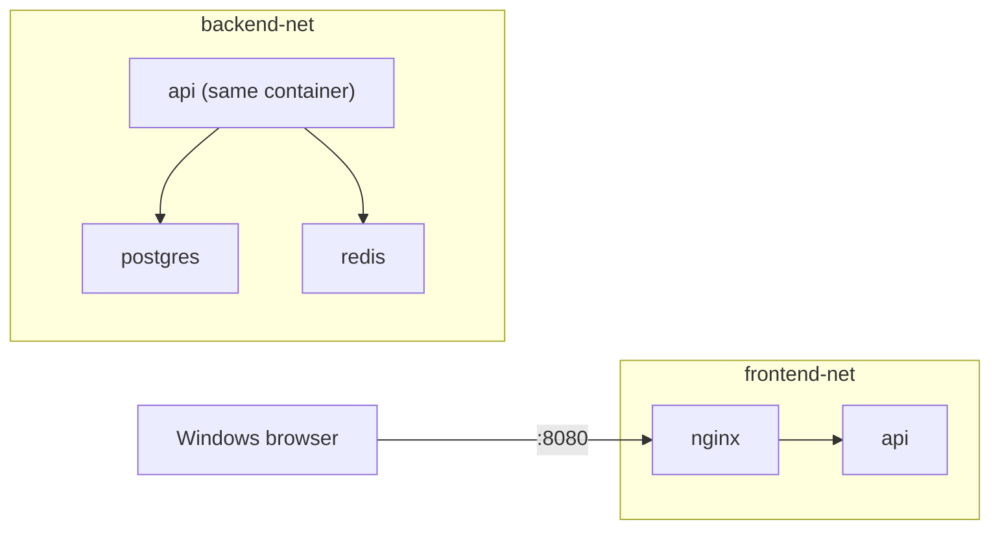

# Day 4 Lab — Networking

**Time:** ~2 hours · **Work in:** `~/projects/docker-training`

The most important lab of the week. Exercises 1, 2, 6 and 8 are the core — if
time runs short, do those.

Several exercises ask you to **predict before running**. Do it. Being wrong on
purpose is how the rule sticks.

---

## Exercise 1 — The default bridge has no DNS (15 min)

```bash
docker run -d --name d1 alpine sleep 3600
docker run -d --name d2 alpine sleep 3600
docker inspect d1 --format '{{range $k,$v := .NetworkSettings.Networks}}{{$k}} {{$v.IPAddress}}{{end}}'
docker inspect d2 --format '{{range $k,$v := .NetworkSettings.Networks}}{{$k}} {{$v.IPAddress}}{{end}}'
```

Both are on the network called `bridge`, with addresses in the same subnet.

**Predict: will `d1` be able to ping `d2` by name?**

```bash
docker exec d1 ping -c1 -W2 d2
```

```
ping: bad address 'd2'
```

By IP:

```bash
docker exec d1 ping -c1 -W2 <d2's IP>
```

Works. So they **are** connected — only the name is missing.

```bash
docker exec d1 cat /etc/resolv.conf
docker exec d1 cat /etc/hosts
```

Neither knows anything about `d2`.

**Write down:** what exactly is missing on the default bridge network?

```bash
docker rm -f d1 d2
```

---

## Exercise 2 — A user-defined network has DNS (15 min)

```bash
docker network create demo-net
docker network ls
docker run -d --name u1 --network demo-net alpine sleep 3600
docker run -d --name u2 --network demo-net alpine sleep 3600
docker exec u1 ping -c1 -W2 u2
```

```
1 packets transmitted, 1 packets received, 0% packet loss
```

Where did the name come from?

```bash
docker exec u1 cat /etc/resolv.conf
```

```
nameserver 127.0.0.11
```

```bash
docker exec u1 nslookup u2
```

```
Server:  127.0.0.11
Name:    u2
Address: 172.x.x.x
```

**127.0.0.11 is Docker's embedded DNS**, injected into the container's network
namespace. Nothing in either image or in your shell configured this.

Now add an alias:

```bash
docker run -d --name u3 --network demo-net --network-alias database alpine sleep 3600
docker exec u1 nslookup database
docker exec u1 nslookup u3
```

Both names reach the same container. **This is exactly what Compose does with
service names** — you will see it tomorrow.

**Write down:** the one-sentence difference between the default `bridge`
network and a user-defined one.

---

## Exercise 3 — Look at the actual wiring (15 min)

Only possible because you are on WSL2 with a real kernel. Do it once and the
diagrams stop being abstract.

```bash
ip link show type bridge
```

One bridge per Docker network. Match them up:

```bash
docker network ls --format '{{.ID}}\t{{.Name}}'
```

The bridge for a user-defined network is `br-<first 12 chars of the network ID>`.

Now watch a cable appear:

```bash
ip link | grep -c veth               # count before
docker run -d --name watchme --network demo-net alpine sleep 300
ip link | grep -c veth               # one more
bridge link | grep br-
docker rm -f watchme
ip link | grep -c veth               # back down
```

**Every running container adds one veth end to a bridge.** That is the whole
mechanism.

Look at the network's addressing:

```bash
docker network inspect demo-net --format '{{range .IPAM.Config}}subnet={{.Subnet}} gateway={{.Gateway}}{{end}}'
docker network inspect demo-net --format '{{range .Containers}}{{.Name}} {{.IPv4Address}}{{"\n"}}{{end}}'
```

Then from inside a container:

```bash
docker exec u1 ip addr show eth0
docker exec u1 ip route
```

Its default route points at the bridge's gateway address. **That is how a
container reaches the internet:** out through the bridge, then NAT.

> **`[NEEDS WSL2 DRY-RUN]`** — authored on macOS, where the host cannot see
> `docker0` or veth interfaces. On WSL2 these commands work directly.
> Instructor: confirm output before class.

---

## Exercise 4 — `EXPOSE` publishes nothing (20 min)

```bash
docker image inspect nginx:alpine --format '{{.Config.ExposedPorts}}'
```

```
map[80/tcp:{}]
```

The image declares `EXPOSE 80`. Run it with **no** `-p`:

```bash
docker run -d --name web --network demo-net --network-alias web nginx:alpine
docker ps --filter name=web --format '{{.Names}}\t{{.Ports}}'
```

```
web    80/tcp
```

**No arrow.** Compare with a published container later — the arrow is the tell.

**Predict: can you curl it from WSL2?**

```bash
curl -s --max-time 3 -I localhost:80 || echo "FAILED"
```

Failed. Now from a container on the same network:

```bash
docker run --rm --network demo-net alpine \
  sh -c 'apk add -q curl; curl -s -o /dev/null -w "%{http_code}\n" http://web'
```

```
200
```

**Reachable from inside the network. Not from your host. `EXPOSE` changed
nothing.**

Now publish it:

```bash
docker rm -f web
docker run -d --name web --network demo-net --network-alias web -p 8081:80 nginx:alpine
docker ps --filter name=web --format '{{.Ports}}'
curl -s -o /dev/null -w "%{http_code}\n" localhost:8081
```

```
0.0.0.0:8081->80/tcp
200
```

And from the **Windows browser**: <http://localhost:8081>

Look at the DNAT rule that makes it work:

```bash
sudo iptables -t nat -L DOCKER -n | grep 8081
```

**Write down:** in `-p 8081:80`, which number is the host and which is the
container? Which one must match what the application listens on?

---

## Exercise 5 — Two ways to get the port wrong (15 min)

### Wrong container port

```bash
docker rm -f web
docker run -d --name web -p 8082:8080 nginx:alpine
docker ps --filter name=web --format '{{.Ports}}'
curl -s --max-time 3 -o /dev/null -w "%{http_code}\n" localhost:8082
```

```
0.0.0.0:8082->8080/tcp      ← looks perfectly healthy
000                         ← nothing answers
```

**Why?** nginx listens on 80. Docker forwarded host 8082 to container 8080,
where nothing is listening. Docker cannot know what your app binds — it just
does what you asked.

```bash
docker exec web ss -tln 2>/dev/null || docker exec web netstat -tln
```

That tells you the truth: port 80.

### Bound to `127.0.0.1` inside the container — the hard one

```bash
docker rm -f web
docker run -d --name pyweb -p 8083:8000 python:3.13-alpine \
  sh -c 'mkdir -p /srv && cd /srv && echo hi > index.html && python -m http.server 8000 --bind 127.0.0.1'
sleep 4
docker ps --filter name=pyweb --format '{{.Ports}}'
curl -s --max-time 3 -o /dev/null -w "%{http_code}\n" localhost:8083
```

```
0.0.0.0:8083->8000/tcp      ← correct
000                         ← still nothing
```

Everything looks right. The container is up, the port is published, the port
numbers match. And the app really is running:

```bash
docker exec pyweb wget -qO- http://127.0.0.1:8000
```

```
hi
```

**Predict why, then check:**

```bash
docker exec pyweb netstat -tln
```

It is bound to `127.0.0.1:8000` — the **container's** loopback. Docker forwards
to the container's `eth0` address, where nothing listens.

Fix by binding `0.0.0.0`:

```bash
docker rm -f pyweb
docker run -d --name pyweb -p 8083:8000 python:3.13-alpine \
  sh -c 'mkdir -p /srv && cd /srv && echo hi > index.html && python -m http.server 8000 --bind 0.0.0.0'
sleep 4
curl -s -o /dev/null -w "%{http_code}\n" localhost:8083
```

```
200
```

```bash
docker rm -f pyweb
```

> **This is the hardest of the four failure modes to spot**, because every
> diagnostic looks healthy. Check `app.listen(PORT, '0.0.0.0')` in
> [`labs/app-api/server.js`](../../labs/app-api/server.js) — that line is there
> for exactly this reason.

---

## Exercise 6 — Build the isolation model (25 min)

The pattern you will use on every real project.



```bash
cd ~/projects/docker-training/labs
docker build -t api:ref ./app-api

docker network create frontend-net
docker network create backend-net

# Postgres and Redis: backend only, NOT published
docker run -d --name postgres --network backend-net --network-alias postgres \
  -e POSTGRES_USER=app -e POSTGRES_PASSWORD=app -e POSTGRES_DB=app postgres:17-alpine
docker run -d --name redis --network backend-net --network-alias redis redis:7-alpine

# api: on BOTH networks
docker run -d --name api --network backend-net --network-alias api \
  -e PGHOST=postgres -e REDIS_URL=redis://redis:6379 api:ref
docker network connect frontend-net api

# nginx: frontend only, the ONLY published service
docker run -d --name nginx --network frontend-net -p 8080:80 \
  -v "$PWD/nginx/default.conf":/etc/nginx/conf.d/default.conf:ro nginx:alpine

sleep 6
```

### Verify it works end to end

```bash
curl -s localhost:8080/health
curl -s localhost:8080/ready
curl -s localhost:8080/whoami
```

`/ready` should report both `postgres` and `redis` as `ok` — the API reached
both across `backend-net`.

### Verify the isolation

**Predict each of these before running it.**

```bash
# nginx -> api : same network, should work
docker exec nginx sh -c 'wget -qO- http://api:3000/health'

# nginx -> postgres : different network, should NOT resolve
docker exec nginx sh -c 'nslookup postgres' 2>&1 | tail -3

# api -> postgres : same network, should work
docker exec api sh -c 'nslookup postgres' 2>&1 | tail -3

# host -> postgres : never published, should fail
curl -s --max-time 3 localhost:5432 || echo "unreachable from host (correct)"
```

```bash
docker network inspect frontend-net --format '{{range .Containers}}{{.Name}} {{end}}'
docker network inspect backend-net  --format '{{range .Containers}}{{.Name}} {{end}}'
```

`api` appears in both. That is what makes it the bridge between tiers.

### Now test how strong the isolation actually is

Name resolution is blocked. What about a raw IP?

```bash
PGIP=$(docker inspect postgres --format '{{range .NetworkSettings.Networks}}{{.IPAddress}}{{end}}')
echo "postgres IP: $PGIP"
docker exec nginx sh -c "ping -c1 -W2 $PGIP" 2>&1 | tail -2
```

**Record the result.** On standard Docker Engine on Linux this should be
dropped by iptables. Check whether the rules are actually being hit:

```bash
sudo iptables -L DOCKER-FORWARD -n -v 2>/dev/null || sudo iptables -L DOCKER-ISOLATION-STAGE-1 -n -v
```

Look at the `pkts` counters. Zero counters mean the traffic is not traversing
these chains at all.

> On the machine this lab was written on (macOS, a third-party Docker
> distribution), the cross-network ping **succeeded** and the counters stayed at
> zero. Your WSL2 setup uses standard Docker Engine and should behave
> differently. **Report what you actually observe.**

**The lesson either way:** name isolation is what you design with; packet-level
isolation is an implementation detail that varies. For anything that matters,
also do not publish the port, use `internal: true`, and require credentials.

> **`[NEEDS WSL2 DRY-RUN]`** — instructor: record the real WSL2 result and
> update this exercise.

### Draw it

**On paper**, draw what you just built: both networks, which container is on
which, which port is published, and the path of one request from the Windows
browser to Postgres. Compare with a neighbour.

Leave this stack running for Exercise 7.

---

## Exercise 7 — Debug with netshoot (15 min)

```bash
docker run -it --rm --network container:api nicolaka/netshoot
```

`--network container:api` puts netshoot **inside the API's network namespace**
— same IP, same interfaces, same DNS. You are looking at the API's networking
without adding anything to its image.

Inside:

```bash
ip addr                       # the API's addresses -- note it has TWO
dig postgres                  # who answers, and what?
dig +short redis
curl -s http://localhost:3000/health
nc -zv postgres 5432
nc -zv redis 6379
ss -tln
```

Then watch live traffic:

```bash
tcpdump -i any -n port 5432 &
curl -s http://localhost:3000/ready
```

You just watched the API's Postgres query on the wire.

```bash
exit
```

**Question:** `ip addr` showed two addresses. Why does the API have two, when
nginx and postgres have one each?

---

## Exercise 8 — Break and fix (25 min)

Five broken scenarios. For each: **predict the symptom, run it, diagnose it
using the four-cause table, then fix it.** Time yourself — aim for under three
minutes each by the end.

Tear down the previous stack first:

```bash
docker rm -f nginx api postgres redis
docker network rm frontend-net backend-net
docker network create demo-net
docker run -d --name postgres --network demo-net --network-alias postgres \
  -e POSTGRES_USER=app -e POSTGRES_PASSWORD=app -e POSTGRES_DB=app postgres:17-alpine
docker run -d --name redis --network demo-net --network-alias redis redis:7-alpine
sleep 5
```

### Scenario 1 — wrong service name

```bash
docker run -d --name api1 --network demo-net \
  -e PGHOST=postgress -e REDIS_URL=redis://redis:6379 -p 8090:3000 api:ref
sleep 4
curl -s localhost:8090/ready
```

Diagnose. Which of the four causes? What is the one-word fix?

### Scenario 2 — wrong network

```bash
docker run -d --name api2 \
  -e PGHOST=postgres -e REDIS_URL=redis://redis:6379 -p 8091:3000 api:ref
sleep 4
curl -s localhost:8091/ready
docker exec api2 nslookup postgres 2>&1 | tail -2
```

Which network did `api2` land on, and why does that break it? Fix it **without
recreating the container.**

<details>
<summary>Hint</summary>

`docker network connect`. Then check whether the running process picks it up —
and think about why or why not.
</details>

### Scenario 3 — wrong port

```bash
docker run -d --name api3 --network demo-net \
  -e PGHOST=postgres -e PGPORT=5433 -e REDIS_URL=redis://redis:6379 -p 8092:3000 api:ref
sleep 4
curl -s localhost:8092/ready
```

The name resolves this time. What is the error, and how is it different from
Scenario 1's?

### Scenario 4 — published to the wrong container port

```bash
docker run -d --name api4 --network demo-net \
  -e PGHOST=postgres -e REDIS_URL=redis://redis:6379 -p 8093:3001 api:ref
sleep 4
docker ps --filter name=api4 --format '{{.Ports}}'
curl -s --max-time 3 localhost:8093/health || echo "FAILED"
docker exec api4 wget -qO- http://localhost:3000/health
```

The app is fine. The publish is wrong. **How would you spot this in ten
seconds?**

### Scenario 5 — the WSL2 one

```bash
docker run -d --name api5 --network demo-net \
  -e PGHOST=postgres -e REDIS_URL=redis://redis:6379 -p 8094:3000 api:ref
sleep 4
curl -s localhost:8094/health           # from WSL2
```

Now open <http://localhost:8094/health> in your **Windows browser**.

If it works, good — hop 1 is healthy on your machine. If it does not, you have
found a real WSL2 localhost-forwarding problem, and
[WSL2-NOTES.md](../../WSL2-NOTES.md) #8 is your procedure. Try the fallback:

```bash
wsl.exe hostname -I
```

then browse to `http://<that IP>:8094/health`.

**Write down:** what does it tell you if the WSL IP works but `localhost` does
not?

### Clean up

```bash
docker rm -f api1 api2 api3 api4 api5 postgres redis
```

---

## Clean up everything

```bash
docker rm -f $(docker ps -aq) 2>/dev/null
docker network rm demo-net other-net frontend-net backend-net 2>/dev/null
docker network ls
```

You should be back to `bridge`, `host` and `none`. **Those three cannot be
removed** — they are built in.

---

## Done when you can

- [ ] Explain in one sentence why the default bridge has no DNS
- [ ] Say what 127.0.0.11 is without looking it up
- [ ] Explain `EXPOSE` vs `-p` to someone who thinks they are the same
- [ ] Diagnose all five broken scenarios in under three minutes each
- [ ] Draw the two-network isolation model from memory
- [ ] List the four hops from the Windows browser to a database container
- [ ] Say why network separation alone is not a security boundary

→ [Homework](../homework.md)
